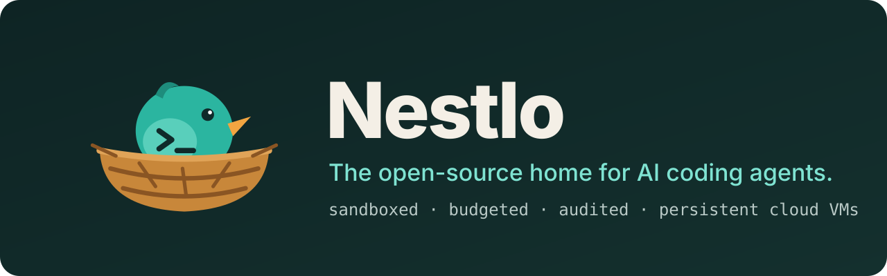
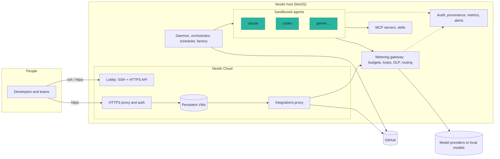
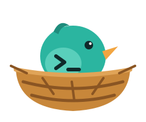

<div align="center">



<br/>

<p>
  <a href="https://github.com/anubhavg-icpl/nestlo/actions/workflows/ci.yml"></a>
  <a href="https://github.com/anubhavg-icpl/nestlo/releases"></a>
  <a href="LICENSE"></a>
  <a href="https://nixos.org"></a>
  <a href="docs/AGENTS.md"></a>
  <a href="CONTRIBUTING.md"></a>
  <a href="https://github.com/anubhavg-icpl/nestlo/stargazers"></a>
</p>

<p>
  <a href="https://anubhavg-icpl.github.io/nestlo/"><b>Website</b></a> ·
  <a href="#quickstart"><b>Quickstart</b></a> ·
  <a href="#whats-inside"><b>What's inside</b></a> ·
  <a href="#nestlo-cloud"><b>Nestlo Cloud</b></a> ·
  <a href="#architecture"><b>Architecture</b></a> ·
  <a href="#documentation"><b>Docs</b></a> ·
  <a href="#contributing"><b>Contributing</b></a>
</p>

</div>

**Nestlo is an operating system for AI coding agents.** It runs Claude Code, Codex, Gemini CLI and 17 more agents on your own hardware, each in a sandbox with a spending cap, behind a gateway that meters every model call. It also gives people and agents persistent cloud VMs with HTTPS, sharing and secret-free integrations, in the style of exe.dev. It is built on NixOS, so the whole system is declared in one file and rebuilds the same way every time.

> [!NOTE]
> **Formerly AgentOS.** The project was renamed to Nestlo in October 2026: NixOS options are now `nestlo.*`, the command is `nestlo`, and services, users and paths use the `nestlo` prefix. Upgrading an existing machine? See [the migration notes](CHANGELOG.md#renamed-from-agentos).

## Why Nestlo

Run a coding agent on a normal machine and it gets your shell, your files, your network and your credit card, with no fence around any of them. Nestlo puts the fence in the operating system:

- **🪺 A sandbox per agent.** Each agent runs as an unprivileged user in its own systemd sandbox (or container) with memory, CPU and process limits. It can write only to its workspace.
- **💸 A budget per agent.** Every LLM call goes through a metering gateway that prices it, enforces daily budgets, detects loops and stops the agent when it runs out. API keys never enter the sandbox.
- **🔒 Default-deny egress.** Only allowlisted domains resolve; agents reach model providers only through the gateway.
- **🧾 Evidence for everything.** A hash-chained, signed audit log, signed provenance on agent commits, DLP on prompts, policy-as-code and four-eyes approval.
- **☁️ VMs for people and agents.** Nestlo Cloud gives every user persistent VMs with their own disks, a private HTTPS URL, sharing, custom domains and integrations that inject secrets at the network edge.
- **🏭 Work, not just chat.** An orchestrator, a scheduler, GitHub triggers and a software factory turn issues into reviewed pull requests.

## Quickstart

**Prerequisites:** [Nix](https://nixos.org/download) with flakes enabled, on x86_64-linux or aarch64-linux.

**Option 1: try it in a VM**

```bash
git clone https://github.com/anubhavg-icpl/nestlo.git nestlo && cd nestlo
nix build .#vm-image                          # a QEMU/KVM disk image
cp result/*.qcow2 nestlo.qcow2 && chmod u+w nestlo.qcow2
qemu-system-x86_64 -m 8192 -enable-kvm -bios OVMF.fd -drive file=nestlo.qcow2,if=virtio
```

**Option 2: install it on a machine**

```bash
nix build .#iso-image                         # also attached to every GitHub release
sudo dd if=result/iso/nestlo-*.iso of=/dev/sdX bs=4M status=progress
# boot the stick, then (erases the disk; only SSH keys can log in):
sudo nestlo-install /dev/nvme0n1 --ssh-key "ssh-ed25519 AAAA... you@laptop"
```

**Your first agent, with a $5/day budget**

```bash
ssh admin@nestlo
nestlo workspace create api --from https://github.com/me/api.git
nestlo spawn claude --workspace api --budget 5
nestlo list              # agents, status, spend today
nestlo logs <id>         # every model call with tokens and cost
```

**Your first cloud VM** (with [Nestlo Cloud](#nestlo-cloud) enabled)

```bash
ssh lobby@cloud.example.com new --name web
ssh -t lobby@cloud.example.com ssh web        # a shell in the VM
open https://web.cloud.example.com/           # its private HTTPS URL
```

## What's inside

<table>
<tr>
<td valign="top" width="33%">

**Run agents safely**
- [20 agents](docs/AGENTS.md) pre-installed
- [Sandboxes](docs/containers.md) and containers
- [Metering gateway](docs/gateway-features.md): budgets, loop detection, cost routing, replay
- [Egress allowlist](docs/FEATURES.md), AppArmor
- [GPU scheduling](docs/gpu.md), [local models](docs/local-ai.md): Ollama, llama.cpp, [LocalAI and vLLM](docs/local-ai-backends.md)
- [Agent security](docs/agent-security.md): red-team, MCP and skill scan, PR review
- [Runtime security](docs/agent-runtime-security.md): Tetragon eBPF policies for agent processes

</td>
<td valign="top" width="33%">

**Get work done**
- [Orchestrator and scheduler](docs/orchestration.md): tasks, DAGs, swarms
- [GitHub triggers](docs/triggers.md): issue to pull request
- [Software factory](docs/factory.md): plan, build, review, QA
- [Skill packs](docs/skills.md) for every agent CLI
- [36 MCP servers](docs/FEATURES.md), [herdr](docs/herdr.md) workspaces
- [TUIOS](docs/tuios.md): terminal multiplexer with agent state, inbox and fan-out
- [Agent Orca](docs/orca.md): Kubernetes operator for agents on k3s
- [OpenShell](docs/openshell.md): NVIDIA's sandboxed agent runtime
- [A2A and ACP](docs/a2a.md): agents as A2A servers, editors over ACP
- [agentgateway](docs/agentgateway.md) and [ToolHive](docs/toolhive.md): per-agent MCP authorization, MCP servers in containers

</td>
<td valign="top" width="33%">

**Run it like production**
- [Nestlo Cloud](docs/cloud.md): VMs, HTTPS, sharing, teams
- [Mobile](docs/mobile.md): pair an Android phone with one QR; agents, approvals, terminals and the desktop, over LAN, Tailscale or a tunnel
- [Audit log](docs/audit.md) and [DLP](docs/dlp.md)
- [Provenance](docs/provenance.md), [policy and RBAC](docs/policy.md)
- [Identity and secrets](docs/agent-identity.md): SPIRE, Cedar, [OpenBao](docs/openbao.md)
- [LLM observability](docs/llm-observability.md): GenAI traces, Langfuse, OpenLIT
- [Beacon](docs/beacon.md): session replay and reviewed memory
- [Dashboard](docs/dashboard.md), Prometheus, Grafana, alerts
- [Backups, safe upgrades](docs/operations.md), SBOM

</td>
</tr>
</table>

<details>
<summary><b>All modules</b></summary>


| Module | Description | CLI Command |
|:---|:---|:---|
| runtime | Agent sandbox, daemon, workspaces, control-plane Redis | `nestlo spawn` |
| security | AppArmor, default-deny egress allowlist, auditd | automatic |
| observability | Prometheus + Tempo + Grafana | Grafana `:2342` |
| storage | btrfs snapshots, dedup, workspace GC | `nestlo snapshot` |
| networking | Metering model gateway, agent bridge, NAT | automatic |
| context | Qdrant vector DB, persistent memory | `nestlo-memory` |
| orchestration | Multi-agent coordination † | `nestlo-orchestrate` |
| factory | Software factory: planner, builder, verify, reviewer, fix loop, QA, then PR or auto-merge | `nestlo-factory` |
| policy | Typed policy-as-code and RBAC roles on the orchestrator socket | `nestlo-task policy show`, `whoami` |
| mcp-registry | 14 core MCP tools | `nestlo-tools` |
| mcp-servers | 36 MCP servers (8 categories) | `nestlo-mcp` |
| budget-controller | Per-agent and global daily caps, auto-shutdown | `nestlo-budget` |
| circuit-breaker | Rate limit, circuit breaker, resource limits | `nestlo-breaker` |
| secrets-manager | sops-nix encrypted API keys | `nestlo-secrets` |
| audit | Tamper-evident audit log, SIEM export, gateway DLP (`nestlo.audit`, `nestlo.gateway.dlp`) | `nestlo-audit` |
| git-automation | Branch/commit/PR helpers, hooks (auto-commit †) | `nestlo-git` |
| provenance | Signed provenance for agent-authored commits (Ed25519, in-toto/DSSE, commit status) | `nestlo-provenance` |
| provisioning | Env detection, Nix dev shells | `nestlo-env` |
| scheduler | Cron-like task scheduling † | `nestlo-schedule` |
| notifications | Slack, Discord, webhook | `nestlo-notify` |
| language-toolchains | 20+ runtimes pre-installed | `nestlo-langs` |
| databases | Postgres, Redis, SQLite, DuckDB | `nestlo-db` |
| dev-tools | 100+ developer utilities | automatic |
| security-tools | Semgrep, trivy, nmap, ghidra | `nestlo-scan` |
| browser-tools | Chromium, Playwright, Puppeteer | `nestlo-web` |
| networking-tools | nmap, tcpdump, wireshark | automatic |
| cloud-tools | AWS, GCP, Azure, CF, Vercel CLIs | automatic |
| package-managers | pip, npm, cargo, bundler, maven | automatic |
| editors | Neovim (LSP configured), Helix | automatic |
| ai-ml | Ollama, llama.cpp, PyTorch, Jupyter | automatic |
| vibe-integration | 853 modes, 5340 skills from VIBE | `nestlo-vibe` |
| skills | Skill packs linked into every agent CLI | `nestlo-skills` |
| herdr | Persistent agent workspaces, status bridge, plugin marketplace | `nestlo-herdr`, `nestlo-herdr-plugins` |
| tuios | TUIOS: persistent agent workspaces with agent state, inbox, fan-out, SSH and web access, audit and metrics bridge | `nestlo-tuios`, `tuios` |
| orca | Agent Orca: Kubernetes operator for AI agents on single-node k3s, models through the gateway | `aoctl`, `kubectl` |
| openshell | NVIDIA OpenShell: policy-governed agent sandboxes, gateway, prover | `openshell`, `openshell-prover` |

| cloud | Nestlo Cloud: persistent VMs over SSH and HTTPS, private HTTPS proxy, sharing, custom domains, integrations, teams | `ssh lobby@<host> new` |
| triggers | GitHub webhooks to tasks, factory items and pull requests | `nestlo-triggers` |
| fleet | Remote agent fleets over SSH | `nestlo fleet` |
| marketplace | Reviewed agent and skill index | `nestlo market` |
| dashboard | Web dashboard for agents, tasks and spend | `nestlo-dashboard` |
| gpu | GPU scheduling for local inference | automatic |
| local-ai | Ollama or llama.cpp and Open WebUI on the host; LocalAI and vLLM backends (`nestlo.localAI.localai`, `nestlo.localAI.vllm`) | automatic |
| agent-stack | agent-fleet apps (n8n, Flowise, Langflow, ...) through the gateway | automatic |
| agent-fleet-web | In-browser llama.cpp chat and fleet hub | automatic |
| openclaw | Chat front end (Telegram, Slack) for the orchestrator | automatic |
| pullrun | Pullrun OCI runtime and Firecracker microVMs (experimental) | `pullrun` |
| desktop | Desktop edition (i3 with gaps, sway, Hyprland) | automatic |
| backup | restic backups and a restore drill | `nestlo-restore` |
| upgrade | Auto-upgrades that roll back on a failed health gate | automatic |
| agent-security | promptfoo red-team and eval, MCP server and skill admission scan, PR-Agent review, all through the gateway (`nestlo.agentSecurity`) | `nestlo-redteam`, `nestlo-eval`, `nestlo-agent-scan`, `nestlo-pr-review` |
| agent-runtime-security | Tetragon eBPF policies and alerts for agent processes, observe by default (`nestlo.agentRuntimeSecurity`) | automatic |
| agent-identity | SPIFFE/SPIRE workload identity for agents and services (`nestlo.agentIdentity`) and Cedar authorization (`nestlo.cedar`) | `nestlo-svid`, `nestlo-identity`, `nestlo-authz` |
| openbao | OpenBao secrets backend, per-agent secrets by SPIFFE login (`nestlo.openbao`) | `nestlo-bao`, `nestlo-openbao-get` |
| llm-observability | OpenTelemetry GenAI traces from the gateway, optional Langfuse and OpenLIT stacks (`nestlo.llmObservability`) | automatic |
| beacon | Agent Beacon: local session capture, replay and reviewed memory (`nestlo.beacon`) | `beacon`, `nestlo-beacon` |
| agentgateway | Single MCP endpoint with per-agent tool authorization, LLM route into the gateway (`nestlo.agentgateway`) | `nestlo-agentgateway-mcp-config` |
| toolhive | MCP servers in Podman containers with permission profiles (`nestlo.toolhive`) | `thv` |
| a2a | A2A server for Nestlo agents and the ACP launcher for editors (`nestlo.a2a`) | `nestlo-acp` |

† Planned service, not implemented yet ([status](docs/STATUS.md)).

</details>

<details>
<summary><b>Agents</b></summary>

Sixteen agents are built from nixpkgs and pinned by `flake.lock`; four that nixpkgs doesn't package yet are pinned npm/PyPI launchers that download the agent on first run.

| Command | Agent | Provider | Source |
|:---|:---|:---|:---|
| `claude` | Claude Code | Anthropic | nixpkgs |
| `codex` | Codex CLI | OpenAI | nixpkgs |
| `aider` | Aider | Open Source | nixpkgs |
| `gemini` | Gemini CLI | Google | nixpkgs |
| `qwen` | Qwen Code | Alibaba | nixpkgs |
| `amp` | Amp | Sourcegraph | nixpkgs |
| `goose` | Goose | Block | nixpkgs |
| `opencode` | OpenCode | SST | nixpkgs |
| `crush` | Crush | Charm | nixpkgs |
| `cursor-agent` | Cursor CLI | Cursor | nixpkgs |
| `copilot` | GitHub Copilot CLI | GitHub | nixpkgs |
| `kilocode` | Kilo Code CLI | Kilo | nixpkgs |
| `vibe` | Mistral Vibe | Mistral | nixpkgs |
| `kiro-cli` | Kiro CLI | AWS | nixpkgs |
| `codebuff` | Codebuff | Codebuff | nixpkgs |
| `pi` | Pi coding agent | pi-mono | nixpkgs |
| `droid` | Factory Droid | Factory AI | npm launcher |
| `cline` | Cline | Open Source | npm launcher |
| `cn` | Continue CLI | Open Source | npm launcher |
| `interpreter` | Open Interpreter | Open Source | PyPI launcher |

```bash
nestlo spawn claude --workspace api --budget 5          # sandboxed and metered
nestlo spawn aider --workspace api -- --model sonnet    # arguments after -- go to the agent
claude                                                   # directly, as yourself
```

</details>

<details>
<summary><b>Configuration</b></summary>

Every feature is a toggle:

```nix
nestlo = {
  runtime = {
    enable = true;
    maxAgents = 8;
    containerRuntime = "containerd";
  };

  budget-controller = {
    enable = true;
    defaultDailyBudgetUSD = 50.0;
    globalDailyBudgetUSD = 500.0;
    autoShutdown = true;
  };

  circuit-breaker = {
    enable = true;
    maxConsecutiveFailures = 5;
    cooldownPeriodSec = 300;
  };

  vibe-integration = {
    enable = true;
    autoInstallOnBoot = true;
  };

  mcp-servers = {
    enable = true;
    enableCore = true;
    enableDatabases = true;
    enableBrowser = true;
    enableAI = true;
  };

  git-automation = {
    enable = true;
    autoBranch = true;
    autoCommit = true;
    autoPR = true;
  };
};
```

</details>

## Nestlo Cloud

Nestlo Cloud turns a Nestlo host into a self-hosted platform for persistent Linux VMs, for people and for agents. It follows [exe.dev](https://exe.dev)'s design and command set, so exe.dev scripts and tools (including its web agent, Shelley) work unchanged.

```bash
ssh lobby@cloud.example.com new --name web --cpu 4 --memory 8GB   # a VM with its own disk
ssh -t lobby@cloud.example.com ssh web                            # a shell in it
ssh lobby@cloud.example.com share add web alice@example.com       # share its HTTPS URL
ssh lobby@cloud.example.com domain add web app.example.com        # on your own domain
ssh lobby@cloud.example.com integrations add github --name gh \
    --repository acme/web --bearer github_pat_... --attach vm:web  # git without a token in the VM
curl -X POST https://cloud.example.com/exec -H "Authorization: Bearer $TOKEN" -d 'ls'
```

- **VMs** with persistent ext4 disks, user-namespaced root, pooled CPU and memory, OCI images or a Nix-backed image with every agent CLI
- **A private HTTPS URL** per VM: sharing with people or teams, share links, public sites, any port, custom domains with automatic certificates, login by SSH link or SSO
- **Integrations** that add secrets at the network edge: any HTTP API, GitHub repositories, the model gateway (one budget per VM), other VMs
- **Teams, invites and plan quotas**, an HTTPS API with SSH-signed tokens, audit events, metrics

Full reference, including a feature-by-feature mapping to exe.dev: [docs/cloud.md](docs/cloud.md).

## How it compares

| | Nestlo | A plain Linux box | Docker / devcontainers | Hosted agent platforms |
|:---|:---:|:---:|:---:|:---:|
| Runs on your own hardware | ✅ | ✅ | ✅ | ❌ |
| Open source (MIT) | ✅ | ✅ | ✅ | varies |
| Spending cap per agent, enforced | ✅ | ❌ | ❌ | partly |
| API keys kept out of the agent's reach | ✅ | ❌ | ❌ | ✅ |
| Default-deny network for agents | ✅ | manual | manual | varies |
| 20 agents and 36 MCP servers ready to use | ✅ | ❌ | ❌ | ❌ |
| Signed audit log, provenance, DLP | ✅ | ❌ | ❌ | varies |
| Persistent VMs with HTTPS, sharing, domains | ✅ | manual | ❌ | varies |
| Whole system declared and reproducible | ✅ (Nix) | ❌ | partly | ❌ |

## Architecture



Everything above is implemented in [`services/`](services/) (Python) and [`modules/`](modules/) (NixOS), with unit tests and NixOS VM tests. [docs/STATUS.md](docs/STATUS.md) lists exactly what works and how it is tested.

<details>
<summary><b>Repository layout</b></summary>

```
├── flake.nix          the system: hosts, packages, checks
├── modules/           NixOS modules (runtime, networking, cloud, factory, ...)
├── services/          Python services: gateway, daemon, orchestrator, factory, cloud
├── agents/            the agent packages
├── nixos/hosts/       bare metal, VM, ISO and desktop hosts
├── nixos/packages/    CLIs, installer, skill packs, Shelley
├── tests/             NixOS VM tests (nix build .#checks.<system>.<name>)
└── docs/              documentation and runbooks
```

</details>

## Documentation

| Topic | Read |
|:---|:---|
| What works today | [STATUS](docs/STATUS.md) · [ROADMAP](docs/ROADMAP.md) · [CHANGELOG](CHANGELOG.md) |
| Agents and sandboxes | [AGENTS](docs/AGENTS.md) · [containers](docs/containers.md) · [gpu](docs/gpu.md) · [local AI](docs/local-ai.md) · [LocalAI and vLLM](docs/local-ai-backends.md) · [runtime security](docs/agent-runtime-security.md) |
| The model gateway | [gateway features](docs/gateway-features.md) · [DLP](docs/dlp.md) |
| Getting work done | [orchestration](docs/orchestration.md) · [triggers](docs/triggers.md) · [factory](docs/factory.md) · [skills](docs/skills.md) · [herdr](docs/herdr.md) · [TUIOS](docs/tuios.md) · [Agent Orca](docs/orca.md) · [OpenShell](docs/openshell.md) |
| Nestlo Cloud | [cloud](docs/cloud.md) |
| Governance | [audit](docs/audit.md) · [provenance](docs/provenance.md) · [policy and RBAC](docs/policy.md) · [agent security](docs/agent-security.md) · [identity and Cedar](docs/agent-identity.md) · [OpenBao](docs/openbao.md) |
| Observability | [LLM observability](docs/llm-observability.md) · [Beacon](docs/beacon.md) |
| Protocols and tools | [A2A and ACP](docs/a2a.md) · [agentgateway](docs/agentgateway.md) · [ToolHive](docs/toolhive.md) |
| Operating it | [operations](docs/operations.md) · [runbooks](docs/runbooks/) · [dashboard](docs/dashboard.md) · [fleet](docs/fleet.md) · [marketplace](docs/marketplace.md) |
| More | [desktop](docs/desktop.md) · [ARM64](docs/aarch64.md) · [OpenClaw](docs/openclaw.md) · [agent stack](docs/agent-stack.md) · [Pullrun](docs/pullrun.md) · [all features](docs/FEATURES.md) |
| Security | [SECURITY](SECURITY.md) |

## Contributing

Contributions are welcome: new agents, modules, skill packs, docs and bug reports. See [CONTRIBUTING.md](CONTRIBUTING.md).

```bash
git clone https://github.com/anubhavg-icpl/nestlo.git nestlo && cd nestlo
nix develop                                   # the dev shell
nix flake check --no-build --all-systems      # evaluate everything
nix build .#services                          # the service unit tests
nix build .#checks.x86_64-linux.cloud         # a NixOS VM test (KVM recommended)
```

## License

[MIT](LICENSE) © Anubhav Gain · [GitHub](https://github.com/anubhavg-icpl)

<div align="center">
<br/>

<br/>
<sub>If Nestlo is useful to you, a ⭐ helps other people find it.</sub>
</div>
