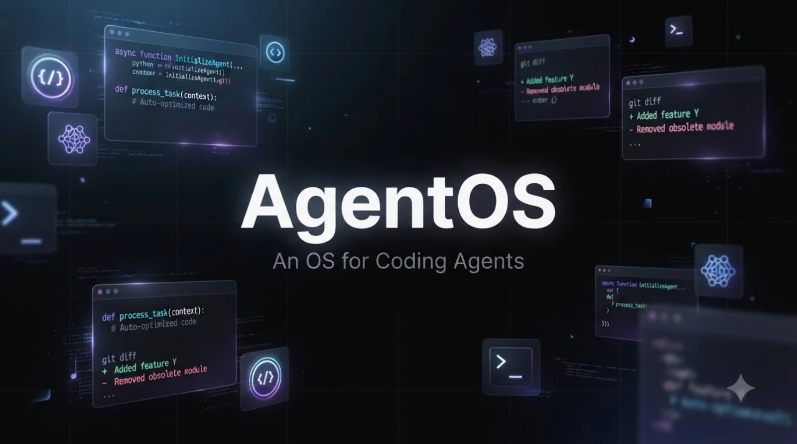
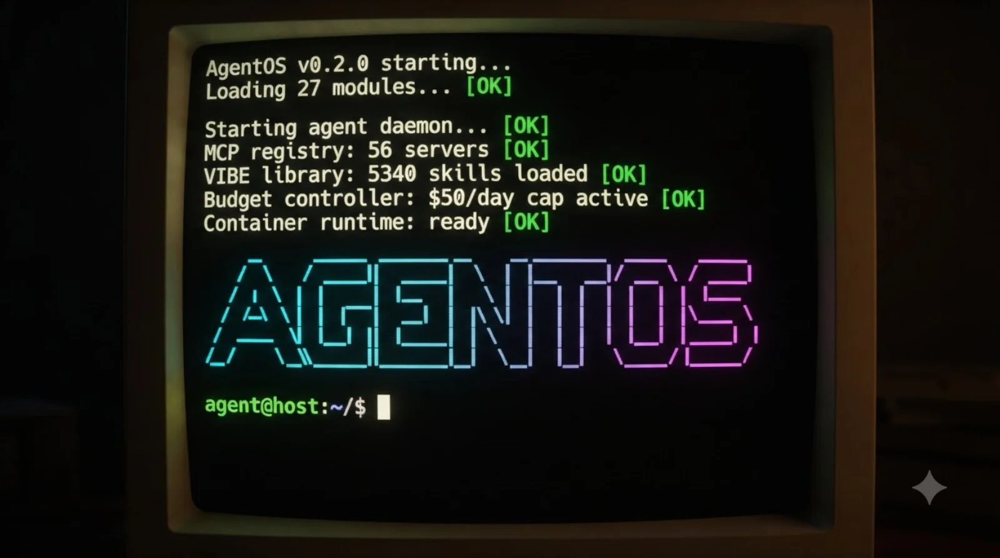
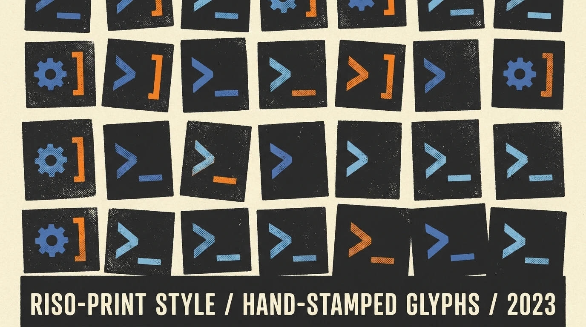
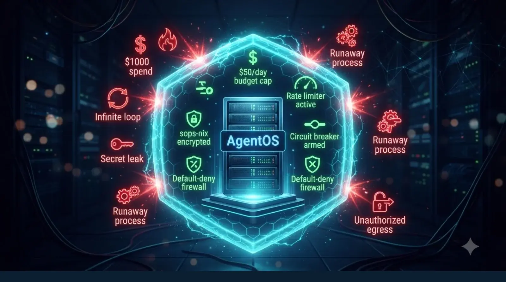
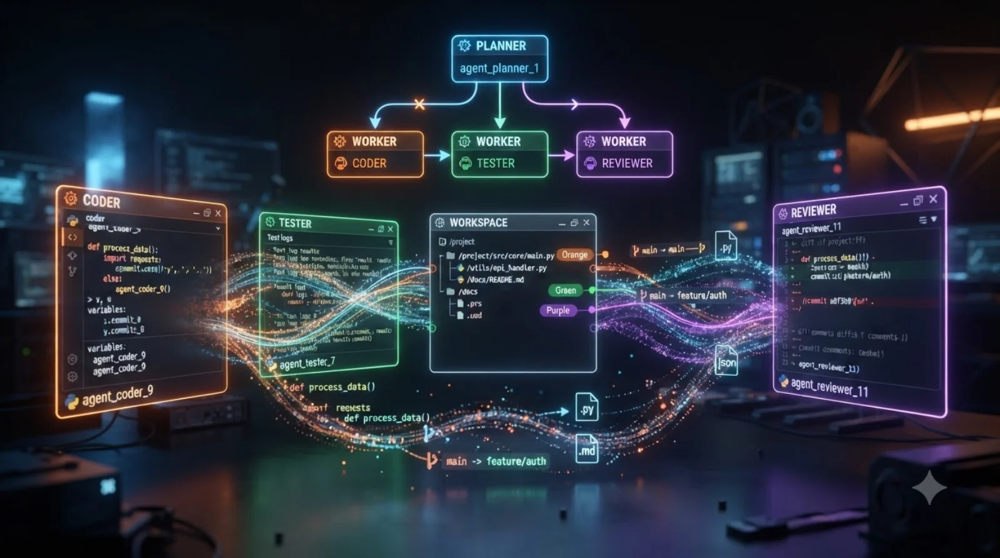
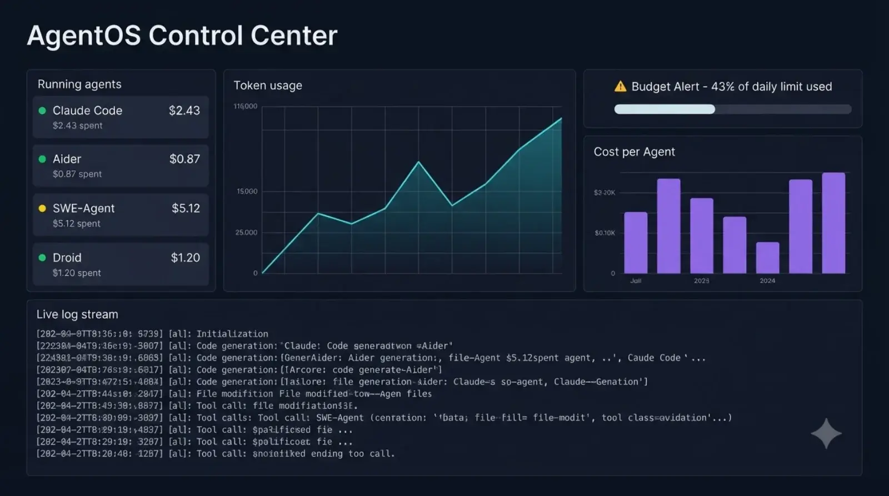
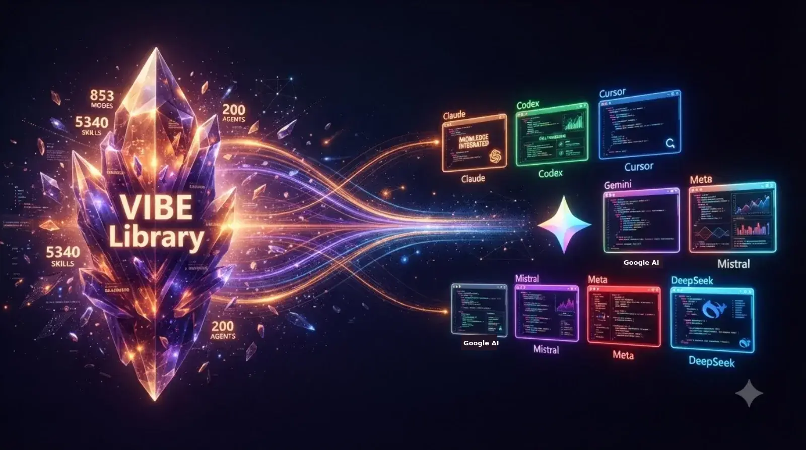
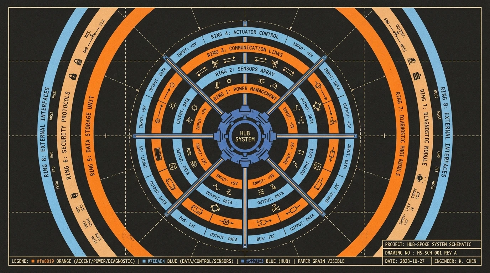
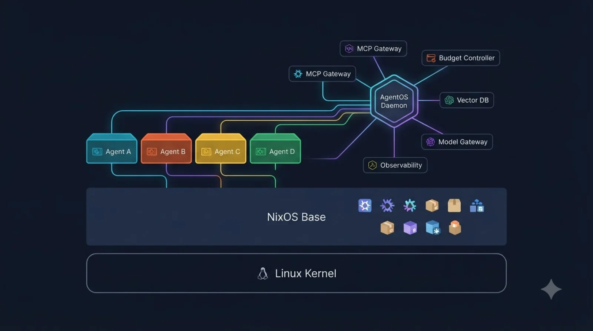
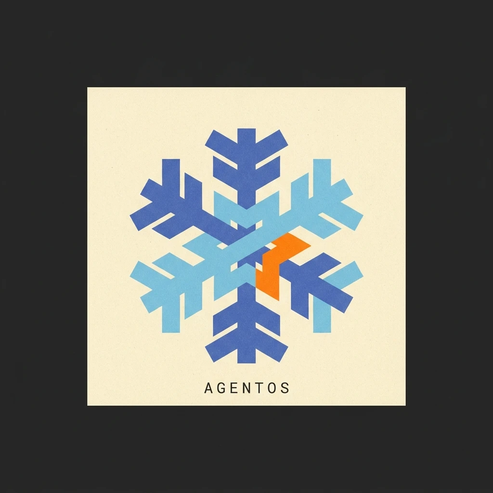

<div align="center">



<br/>

<h1>AgentOS</h1>

<p><strong>The operating system built for AI coding agents.</strong></p>

<p>
  <a href="LICENSE"></a>
  <a href="modules/"></a>
  <a href="docs/AGENTS.md"></a>
  <a href="docs/FEATURES.md"></a>
  <a href="https://github.com/anubhavg-icpl/vibe"></a>
  <a href="https://nixos.org"></a>
</p>

<p>
  <a href="#getting-started"><b>Getting Started</b></a> ·
  <a href="#agents"><b>Agents</b></a> ·
  <a href="#features"><b>Features</b></a> ·
  <a href="#architecture"><b>Architecture</b></a> ·
  <a href="#documentation"><b>Docs</b></a> ·
  <a href="#contributing"><b>Contributing</b></a>
</p>

---

</div>

## Overview

AgentOS is a minimal, NixOS-based operating system where the primary users are **AI coding agents**, not humans. It ships with 22 agents pre-installed, 5,340 expert skills auto-loaded from the VIBE library, 56 MCP tool servers configured, and a complete infrastructure layer for safe, observable, cost-controlled agent execution.

Every layer, from the kernel to the filesystem to the network stack, is optimized for programs that read, write, and execute code autonomously.

<div align="center">
<table>
<tr>
<td align="center"><h3>22</h3><p>Coding Agents</p></td>
<td align="center"><h3>5,340</h3><p>VIBE Skills</p></td>
<td align="center"><h3>56</h3><p>MCP Servers</p></td>
<td align="center"><h3>27</h3><p>NixOS Modules</p></td>
<td align="center"><h3>20+</h3><p>Language Runtimes</p></td>
</tr>
</table>
</div>

---

## The Problem

Run an AI coding agent on a normal machine and you're giving it your shell, your filesystem, and your network with no fence around any of it. There's no spending cap, so a runaway agent can burn real money before anyone notices. Commits happen by hand or not at all. Tool access means installing things yourself, one MCP server at a time. And when something goes wrong, there's no trace of what the agent actually did.

AgentOS puts a fence around each of those problems: per-agent containers, budget caps with automatic shutdown, auto-commit per session, 56 MCP servers pre-wired, and full traces through OpenTelemetry + Prometheus + Grafana — on a NixOS base that rebuilds identically every time.

---

## Getting Started

**Prerequisites:** [Nix](https://nixos.org) with flakes enabled.

```bash
# 1. Build the bootable ISO
nix build .#iso-image

# 2. Flash to USB (or skip to VM)
dd if=result/iso/agentos-*.iso of=/dev/sdX bs=4M status=progress

# 3. Boot from USB and install, or run in a VM:
nix build .#vm-image
qemu-system-x86_64 -m 4096 -enable-kvm -hda result/nixos.qcow2

# 4. SSH in
ssh admin@agentos

# 5. Start any agent — they're all pre-installed
claude           # Anthropic Claude Code
codex            # OpenAI Codex CLI
droid            # Factory Droid
aider            # AI pair programmer
agentos agents   # See all 22 agents
```

<div align="center">


<sub><i>AgentOS boots into a minimal terminal. All 27 modules load automatically. SSH in and start coding.</i></sub>
</div>

---

## Agents

<div align="center">

</div>

<br/>

22 coding agents ship pre-installed. Each gets the same shared base tools (git, ripgrep, fd, gh) so they all work identically regardless of runtime.

### Tier 1 — Primary Production Agents

| Command | Agent | Provider | Focus |
|:---|:---|:---|:---|
| `claude` | Claude Code | Anthropic | Agentic coding CLI |
| `codex` | Codex CLI | OpenAI | Terminal coding agent |
| `droid` | Factory Droid | Factory AI | Software engineering agent |
| `aider` | Aider | Open Source | AI pair programming |
| `gemini` | Gemini CLI | Google | Gemini-powered coding |
| `qwen-code` | Qwen Code | Alibaba | Qwen coding agent |
| `amp` | Amp | Sourcegraph | Code intelligence agent |
| `goose` | Goose | Block | Open-source AI agent |
| `opencode` | OpenCode | SST | Open-source coding agent |
| `crush` | Crush | Charm | Terminal AI agent |

### Tier 2 — Extended Agents

| Command | Agent | Provider |
|:---|:---|:---|
| `cursor` | Cursor CLI | Cursor |
| `cline` | Cline | Open Source |
| `continue` | Continue Dev | Open Source |
| `copilot` | GitHub Copilot CLI | GitHub |
| `devin` | Devin CLI | Cognition |
| `roo` | Roo Code | Open Source |

### Tier 3 — Research & Experimental

| Command | Agent | Provider |
|:---|:---|:---|
| `interpreter` | Open Interpreter | Open Source |
| `sweagent` | SWE-Agent | Princeton |
| `gpt-engineer` | GPT-Engineer | Open Source |
| `devika` | Devika | Open Source |
| `autogpt` | AutoGPT | Open Source |
| `smol-developer` | smol-developer | Open Source |

<details>
<summary><b>Run agents (click to expand)</b></summary>

```bash
# Standalone (direct)
claude
aider --model claude-sonnet-4-20250514
codex "fix the bug"

# Managed (sandboxed, tracked, budget-capped)
agentos spawn claude-code --workspace ./myproject
agentos spawn aider --model claude-sonnet-4-20250514
agentos list           # see running agents
agentos logs <id>      # tail agent logs
agentos kill <id>      # stop an agent
agentos budget         # check spend
```

</details>

Full reference: [docs/AGENTS.md](docs/AGENTS.md)

---

## Features

<div align="center">
<table>
<tr>
<td valign="top" width="33%">

**Infrastructure**
- Container runtime (containerd)
- btrfs snapshots + dedup
- Model API gateway
- AppArmor + egress firewall
- Prometheus + Grafana

</td>
<td valign="top" width="33%">

**Agent Intelligence**
- Vector memory (Qdrant)
- Multi-agent orchestration
- 56 MCP tool servers
- VIBE: 5,340 skills
- Cron task scheduler

</td>
<td valign="top" width="33%">

**Safety & Control**
- Budget controller
- Circuit breaker
- sops-nix secrets
- Git automation
- Slack/Discord alerts

</td>
</tr>
</table>
</div>

### Budget Control & Safety

<div align="center">

</div>

<br/>

| Safety Feature | What It Does |
|:---|:---|
| **Budget caps** | Per-agent daily/session spending limits (default: $50/day) |
| **Auto-shutdown** | Agents that exceed budget are killed automatically |
| **Rate limiting** | Max API calls, file writes, and shell commands per minute |
| **Circuit breaker** | N consecutive failures pauses the agent for cooldown |
| **Resource limits** | Kill agents exceeding CPU/memory thresholds |
| **Loop detection** | Detect and break agents stuck repeating the same action |
| **Egress firewall** | Default-deny network; only whitelisted domains allowed |

```bash
agentos-budget status       # Current spend per agent
agentos-budget history      # 7-day cost breakdown
agentos-breaker status      # Circuit breaker state
```

### Multi-Agent Orchestration

<div align="center">


<sub><i>Agents collaborate through planner-worker, swarm, and pipeline modes.</i></sub>
</div>

<br/>

```bash
agentos-orchestrate run "build a REST API" claude-code
agentos-orchestrate swarm "fix all failing tests" 3
agentos-orchestrate status
```

### Observability Dashboard

<div align="center">


<sub><i>Grafana dashboard at port 2342: agent status, token usage, cost tracking, live logs.</i></sub>
</div>

---

## VIBE Integration

<div align="center">

</div>

<br/>

On first boot, AgentOS auto-installs the [VIBE library](https://github.com/anubhavg-icpl/vibe) into all 7 supported agent CLIs:

| VIBE Asset | Count |
|:---|:---|
| Expert modes | **853** (52 categories) |
| Skills | **5,340** |
| Subagents | **200** |
| Slash commands | **112** |
| Plugins | **120** |
| Rules | **111** |
| System prompts | **759** |
| Recipes | **18** |

```bash
agentos-vibe install       # Install into all agents
agentos-vibe categories    # Browse 52 categories
vibe search "rag"          # Search the library
```

---

## MCP Server Registry

<div align="center">

</div>

<br/>

56 Model Context Protocol servers, pre-configured across 8 categories:

| Category | Count | Key Servers |
|:---|:---:|:---|
| **Core** | 10 | filesystem, git, memory, fetch, sequential-thinking, time, clipboard |
| **Database** | 8 | postgres, sqlite, redis, mongo, duckdb, clickhouse, mysql, surrealdb |
| **Cloud** | 8 | aws, gcp, azure, cloudflare, vercel, fly, railway, supabase |
| **Integration** | 12 | github, gitlab, slack, discord, notion, linear, jira, sentry |
| **Browser** | 4 | puppeteer, playwright, browserbase, selenium |
| **AI/ML** | 4 | openai-tools, anthropic-tools, replicate, huggingface |
| **DevOps** | 6 | docker, kubernetes, terraform, ansible, grafana, prometheus |
| **Data/Search** | 4 | brave-search, tavily, exa, perplexity |

```bash
agentos-mcp list            # List all 56 servers
agentos-mcp enable puppeteer # Enable a server
agentos-mcp stats           # Registry statistics
```

---

## Architecture

<div align="center">

</div>

<br/>

```
┌─────────────────────────────────────────────────────────────────────┐
│                         AgentOS Host                                 │
│                    (NixOS minimal + 27 modules)                     │
│                                                                      │
│  ┌──────────┐ ┌──────────┐ ┌──────────┐ ┌──────────┐               │
│  │ Agent A  │ │ Agent B  │ │ Agent C  │ │ Agent D  │  (containerd) │
│  │ claude   │ │ codex    │ │ droid    │ │ aider    │               │
│  └────┬─────┘ └────┬─────┘ └────┬─────┘ └────┬─────┘               │
│       │            │            │            │                       │
│  ┌────┴────────────┴────────────┴────────────┴────────────────┐     │
│  │              AgentOS Daemon + Orchestrator                 │     │
│  └────┬──────────┬──────────┬──────────┬──────────────────────┘     │
│       │          │          │          │                             │
│  ┌────┴───┐ ┌────┴───┐ ┌────┴───┐ ┌────┴──────────┐                │
│  │ Model  │ │  MCP   │ │ Budget │ │ Observability │                │
│  │Gateway │ │ 56 srv │ │ Ctrl.  │ │ (OTel+P+Graf) │                │
│  └────────┘ └────────┘ └────────┘ └───────────────┘                │
│                                                                      │
│  VIBE: 5340 skills · 853 modes · 200 agents · 759 system prompts   │
│  20+ languages · 6 databases · btrfs snapshots · Qdrant · sops      │
└─────────────────────────────────────────────────────────────────────┘
```

---

## Full Feature Matrix

<details>
<summary><b>All 27 modules (click to expand)</b></summary>

| Module | Description | CLI Command |
|:---|:---|:---|
| runtime | Containerd isolation, agent daemon | `agentos spawn` |
| security | AppArmor, default-deny egress, audit | automatic |
| observability | Prometheus + Tempo + Grafana | Grafana `:2342` |
| storage | btrfs snapshots, dedup, workspace GC | `agentos snapshot` |
| networking | Model API gateway, egress firewall | automatic |
| context | Qdrant vector DB, persistent memory | `agentos-memory` |
| orchestration | Multi-agent coordination | `agentos-orchestrate` |
| mcp-registry | 15+ core MCP tools | `agentos-tools` |
| mcp-servers | 56 MCP servers (8 categories) | `agentos-mcp` |
| budget-controller | Per-agent cost caps, auto-shutdown | `agentos-budget` |
| circuit-breaker | Rate limiting, runaway detection | `agentos-breaker` |
| secrets-manager | sops-nix encrypted API keys | `agentos-secrets` |
| git-automation | Auto-branch, auto-commit, auto-PR | `agentos-git` |
| provisioning | Env detection, Nix dev shells | `agentos-env` |
| scheduler | Cron-like task scheduling | `agentos-schedule` |
| notifications | Slack, Discord, email, webhook | `agentos-notify` |
| language-toolchains | 20+ runtimes pre-installed | `agentos-langs` |
| databases | Postgres, Redis, SQLite, DuckDB | `agentos-db` |
| dev-tools | 100+ developer utilities | automatic |
| security-tools | Semgrep, trivy, nmap, ghidra | `agentos-scan` |
| browser-tools | Chromium, Playwright, Puppeteer | `agentos-web` |
| networking-tools | nmap, tcpdump, wireshark | automatic |
| cloud-tools | AWS, GCP, Azure, CF, Vercel CLIs | automatic |
| package-managers | pip, npm, cargo, bundler, maven | automatic |
| editors | Neovim (LSP configured), Helix | automatic |
| ai-ml | Ollama, llama.cpp, PyTorch, Jupyter | automatic |
| vibe-integration | 853 modes, 5340 skills from VIBE | `agentos-vibe` |

</details>

Detailed docs: [docs/FEATURES.md](docs/FEATURES.md)

---

## Configuration

Every feature is a toggle:

```nix
agentos = {
  runtime = {
    enable = true;
    maxAgents = 8;
    containerRuntime = "containerd";
  };

  budget-controller = {
    enable = true;
    defaultDailyBudgetUSD = 50.0;
    globalDailyBudgetUSD = 500.0;
    autoShutdown = true;
  };

  circuit-breaker = {
    enable = true;
    maxConsecutiveFailures = 5;
    cooldownPeriodSec = 300;
  };

  vibe-integration = {
    enable = true;
    autoInstallOnBoot = true;
  };

  mcp-servers = {
    enable = true;
    enableCore = true;
    enableDatabases = true;
    enableBrowser = true;
    enableAI = true;
  };

  git-automation = {
    enable = true;
    autoBranch = true;
    autoCommit = true;
    autoPR = true;
  };
};
```

---

## Comparison

Most of what AgentOS ships — budget caps, circuit breakers, MCP servers, snapshots, vector memory, orchestration — doesn't exist on plain Linux at all; you'd build it yourself. Docker gets you isolation and not much else. The pieces that do exist elsewhere (Prometheus/Grafana, encrypted secrets, language runtimes) are manual setup on both; AgentOS ships them wired in. The one Docker gets partial credit for is reproducibility — a Dockerfile is repeatable, but not bit-for-bit the way a NixOS derivation is.

---

## Project Structure

```
agentos/
├── flake.nix                       # Top-level Nix flake
├── modules/                        # 27 NixOS modules
│   ├── runtime/                    #   Containerd isolation + daemon
│   ├── budget-controller/          #   Cost tracking + auto-shutdown
│   ├── circuit-breaker/            #   Rate limiting + loop detection
│   ├── mcp-servers/                #   56 preconfigured MCP servers
│   ├── vibe-integration/           #   5340 skills auto-installer
│   ├── context/                    #   Qdrant vector memory
│   ├── orchestration/              #   Multi-agent coordination
│   ├── git-automation/             #   Auto-branch/commit/PR
│   ├── language-toolchains/        #   20+ language runtimes
│   ├── databases/                  #   Postgres, Redis, SQLite, DuckDB
│   └── ...                         #   17 more modules
├── agents/                         # 22 coding agent packages
├── nixos/
│   ├── hosts/                      # Host configs (bare metal + ISO)
│   └── packages/                   # Internal binaries + CLI tools
├── templates/                      # Agent workspace template
├── assets/                         # WebP images
└── docs/                           # Documentation
```

---

## Documentation

| Document | Description |
|:---|:---|
| [docs/AGENTS.md](docs/AGENTS.md) | All 22 agents with usage examples and API key setup |
| [docs/FEATURES.md](docs/FEATURES.md) | Detailed documentation of all 27 modules |
| [docs/ISO-SIZE.md](docs/ISO-SIZE.md) | ISO size analysis by configuration |
| [CHANGELOG.md](CHANGELOG.md) | Version history and release notes |
| [CONTRIBUTING.md](CONTRIBUTING.md) | How to contribute: add modules, agents, and more |

---

## Roadmap

- [ ] GPU scheduling for local model inference
- [ ] Remote agent fleets (multi-machine orchestration)
- [ ] Agent marketplace (community-contributed agents)
- [ ] Web dashboard (beyond Grafana)
- [ ] ARM64 / Apple Silicon support
- [ ] Deterministic replay of agent sessions
- [ ] Inter-agent communication protocol
- [ ] Cost optimization (auto-route to cheapest model)

---

## Contributing

Contributions are welcome. See [CONTRIBUTING.md](CONTRIBUTING.md) for:

- How to add a new module
- How to add a new agent
- Commit conventions
- Testing guidelines

```bash
git clone https://github.com/anubhavg-icpl/agentos.git
cd agentos
nix develop          # Enter dev shell
nix build .#iso-image # Build ISO to test
```

---

<div align="center">



<br/>

## License

**MIT** — See [LICENSE](LICENSE)

## Author

**Anubhav Gain**
[GitHub](https://github.com/anubhavg-icpl) · [VIBE Library](https://github.com/anubhavg-icpl/vibe)

<br/>

---

If AgentOS is useful to you, consider ⭐ starring the repository.

</div>
